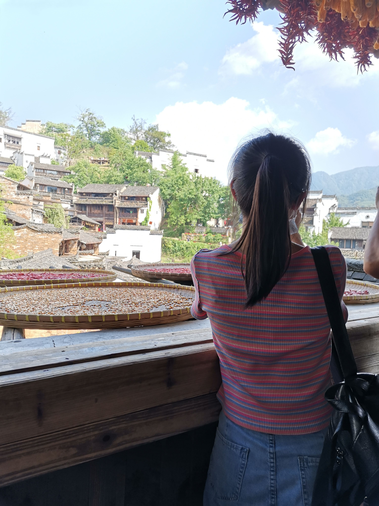

# 三清山

## 路线

| 行程  | 景点/活动  | 住宿
| ------------ | ------------ |
| 5.1  [赣州 -> 鹰潭](https://kyfw.12306.cn/otn/leftTicket/init?linktypeid=dc&fs=%E8%B5%A3%E5%B7%9E,GZG&ts=%E9%B9%B0%E6%BD%AD,YTG&date=2020-05-01&flag=N,N,Y)  [广州南 -> 鹰潭](https://kyfw.12306.cn/otn/leftTicket/init?linktypeid=dc&fs=%E5%B9%BF%E5%B7%9E%E5%8D%97,IZQ&ts=%E9%B9%B0%E6%BD%AD,YTG&date=2020-05-01&flag=N,N,Y)  |   | 鹰潭火车站附近住宿
| 5.2  [鹰潭 -> 上饶](https://kyfw.12306.cn/otn/leftTicket/init?linktypeid=dc&fs=%E9%B9%B0%E6%BD%AD,YTG&ts=%E4%B8%8A%E9%A5%B6,SRG&date=2020-05-01&flag=N,N,Y)  上饶 -> 玉山  | [天师府](https://you.ctrip.com/sight/longhushan160/14381.html)  [仙水岩芦溪河竹筏漂流](https://you.ctrip.com/sight/longhushan160/14319.html)  | 玉山住宿
| 5.3  三清山 -> 上饶站  | [西海岸景区](https://you.ctrip.com/sight/sanqingshan159/44814.html)  [阳光海岸景区](https://you.ctrip.com/sight/sanqingshan159/44824.html)  [南清园景区](https://you.ctrip.com/sight/sanqingshan159/17835.html)  | 上饶站附近住宿
| 5.4  [上饶 -> 婺源](https://kyfw.12306.cn/otn/leftTicket/init?linktypeid=dc&fs=%E4%B8%8A%E9%A5%B6,SRG&ts=%E5%A9%BA%E6%BA%90,WYG&date=2020-05-03&flag=N,N,Y)  |   | 婺源或上饶站附近住宿
| 5.5  [上饶 -> 赣州](https://kyfw.12306.cn/otn/leftTicket/init?linktypeid=dc&fs=%E4%B8%8A%E9%A5%B6,SRG&ts=%E8%B5%A3%E5%B7%9E,GZG&date=2020-05-04&flag=N,N,Y)  [上饶 - > 广州南](https://kyfw.12306.cn/otn/leftTicket/init?linktypeid=dc&fs=%E4%B8%8A%E9%A5%B6,SRG&ts=%E5%B9%BF%E5%B7%9E%E5%8D%97,IZQ&date=2020-05-04&flag=N,N,Y)  |   |

### 5.1 启程

[赣州 -> 鹰潭](https://kyfw.12306.cn/otn/leftTicket/init?linktypeid=dc&fs=%E8%B5%A3%E5%B7%9E,GZG&ts=%E9%B9%B0%E6%BD%AD,YTG&date=2020-05-01&flag=N,N,Y)

[广州南 -> 鹰潭](https://kyfw.12306.cn/otn/leftTicket/init?linktypeid=dc&fs=%E5%B9%BF%E5%B7%9E%E5%8D%97,IZQ&ts=%E9%B9%B0%E6%BD%AD,YTG&date=2020-05-01&flag=N,N,Y)

鹰潭火车站附近住宿

### 5.2 龙虎山

[鹰潭 -> 上饶](https://kyfw.12306.cn/otn/leftTicket/init?linktypeid=dc&fs=%E9%B9%B0%E6%BD%AD,YTG&ts=%E4%B8%8A%E9%A5%B6,SRG&date=2020-05-01&flag=N,N,Y)

[天师府](https://you.ctrip.com/sight/longhushan160/14381.html)

[仙水岩芦溪河竹筏漂流](https://you.ctrip.com/sight/longhushan160/14319.html)

[上饶站 -> 玉山] 打车

玉山住宿

### 5.3 三清山

[西海岸景区](https://you.ctrip.com/sight/sanqingshan159/44814.html)

[阳光海岸景区](https://you.ctrip.com/sight/sanqingshan159/44824.html)

[南清园景区](https://you.ctrip.com/sight/sanqingshan159/17835.html)

上饶站附近住宿

### 5.4 婺源（可选）

[上饶 -> 婺源](https://kyfw.12306.cn/otn/leftTicket/init?linktypeid=dc&fs=%E4%B8%8A%E9%A5%B6,SRG&ts=%E5%A9%BA%E6%BA%90,WYG&date=2020-05-03&flag=N,N,Y)

婺源或上饶站附近住宿

### 5.5 返程

[上饶 -> 赣州](https://kyfw.12306.cn/otn/leftTicket/init?linktypeid=dc&fs=%E4%B8%8A%E9%A5%B6,SRG&ts=%E8%B5%A3%E5%B7%9E,GZG&date=2020-05-04&flag=N,N,Y)

[上饶 - > 广州南](https://kyfw.12306.cn/otn/leftTicket/init?linktypeid=dc&fs=%E4%B8%8A%E9%A5%B6,SRG&ts=%E5%B9%BF%E5%B7%9E%E5%8D%97,IZQ&date=2020-05-04&flag=N,N,Y)

## 攻略

## 图集

