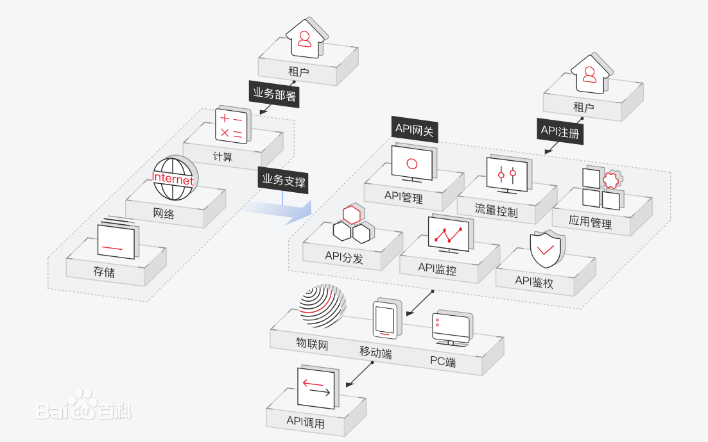

# API网关Ocelot

## 一、什么是API网关

> API网关是所有应用的统一入口，一般放在微服务的最前端。从面向对象设计的角度看，它与外观模式类似。API网关封装了系统内部架构，为每个客户端提供一个定制的API，简化了客户端的调用。API网关的核心要点是：所有的客户端和消费端都通过统一的网关接入微服务，在网关层处理所有的非业务功能（比如负载均衡、流控、熔断、验证、鉴权、监控等等）。

**参考资料**

> [《谈谈微服务中的 API 网关（API Gateway）》](https://www.cnblogs.com/savorboard/p/api-gateway.html)

> [.NET Core微服务之基于Ocelot实现API网关服务](https://www.cnblogs.com/edisonchou/p/api_gateway_ocelot_foundation_01.html)

> [浅谈微服务之API网关](https://cloud.tencent.com/developer/news/257354)

## 二、Ocelot介绍

> Ocelot是一个.NET API网关。该项目针对的是使用.NET运行面向微服务/面向服务的体系结构的人，这些体系结构需要统一的入口点。

**OCelot特征**

* 路由
* 请求聚合
* Consul和Eureka的服务发现
* Kubernetes
* WebSockets
* 认证
* 授权
* 限速
* 高速缓存
* 重试策略/ QoS
* 负载均衡
* 记录/跟踪/关联
* 标头/查询字符串/声明转换
* 自定义中间件/委托处理程序
* 配置/管理REST API

[项目地址github](https://github.com/ThreeMammals/Ocelot)